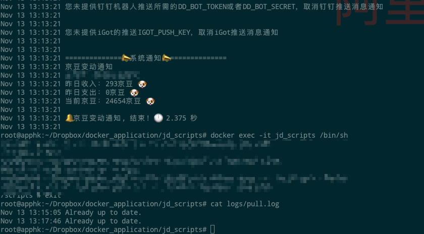
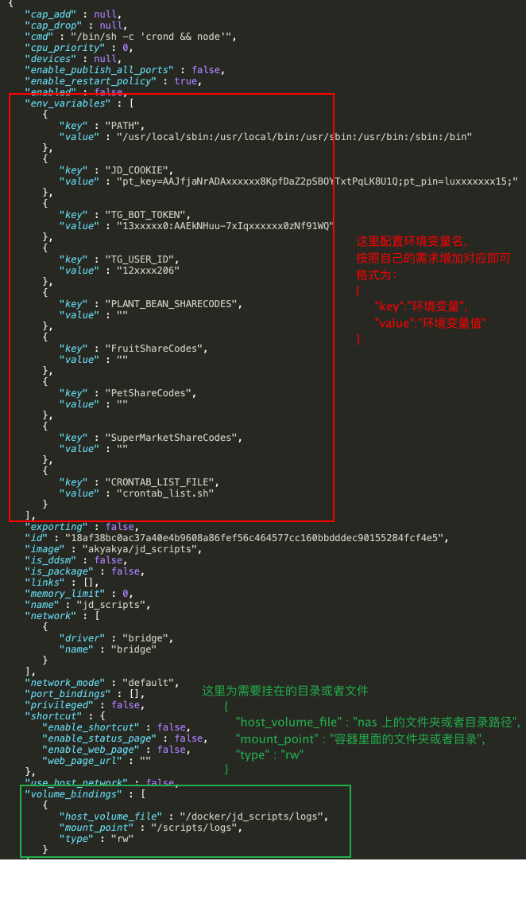
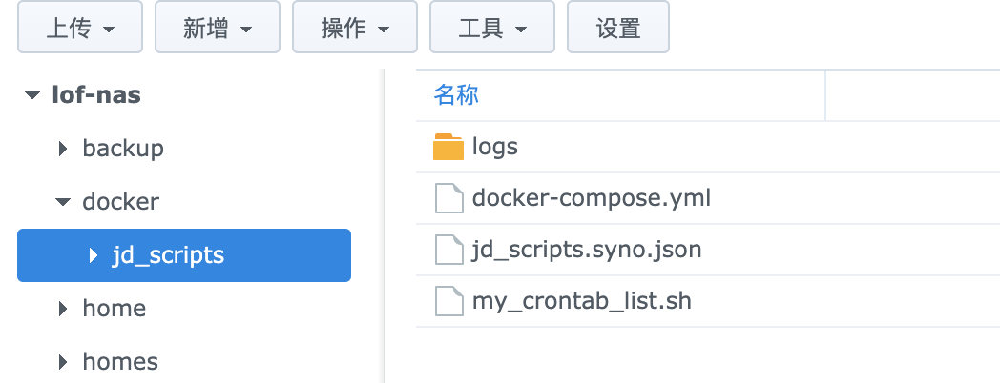
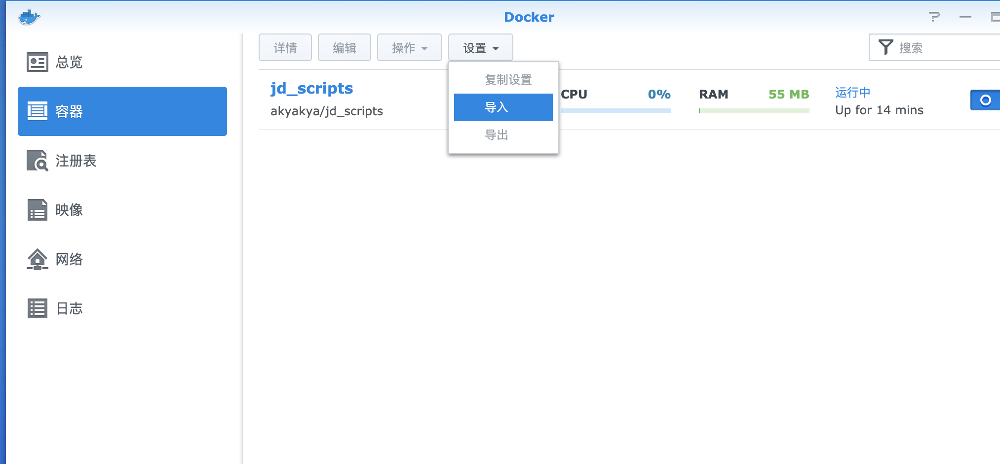

### Usage

> 推荐使用`docker-compose`所以这里只介绍`docker-compose`使用方式


Docker安装 

- 国内一键安装 `sudo curl -sSL https://get.daocloud.io/docker | sh`
- 国外一键安装 `sudo curl -sSL get.docker.com | sh`
- 北京外国语大学开源软件镜像站 `https://mirrors.bfsu.edu.cn/help/docker-ce/`


docker-compose 安装（群晖`nas docker`自带安装了`docker-compose`）

```
sudo curl -L "https://github.com/docker/compose/releases/download/1.24.1/docker-compose-$(uname -s)-$(uname -m)" -o /usr/local/bin/docker-compose
sudo chmod +x /usr/local/bin/docker-compose
```
`Ubuntu`用户快速安装`docker-compose`
```
sudo apt-get update && sudo apt-get install -y python3-pip curl vim git moreutils
pip3 install --upgrade pip
pip install docker-compose
```

通过`docker-compose version`查看`docker-compose`版本，确认是否安装成功。


### 如果需要使用 docker 多个账户独立并发执行定时任务，[参考这里]()  

> 注⚠️：前提先理解学会使用这下面的教程
### 创建一个目录`jd_scripts`用于存放备份配置等数据，迁移重装的时候只需要备份整个jd_scripts目录即可
需要新建的目录文件结构参考如下:
```
jd_scripts
├── logs
│   ├── XXXX.log
│   └── XXXX.log
├── my_crontab_list.sh
└── docker-compose.yml
```
- `jd_scripts/logs`建一个空文件夹就行
- `jd_scripts/docker-compose.yml` 参考内容如下(自己动手能力不行搞不定请使用默认配置)：
- - [使用默认配置用这个](./example/default.yml)
- - [使用自定义任务追加到默认任务之后用这个](./example/custom-append.yml)
- - [使用自定义任务覆盖默认任务用这个](./example/custom-overwrite.yml)
- - [一次启动多容器并发用这个](./example/multi.yml)
- - [使用群晖默认配置用这个](./example/jd_scripts.syno.json)
- - [使用群晖自定义任务追加到默认任务之后用这个](./example/jd_scripts.custom-append.syno.json)
- - [使用群晖自定义任务覆盖默认任务用这个](./example/jd_scripts.custom-overwrite.syno.json)
- `jd_scripts/docker-compose.yml`里面的环境变量(`environment:`)配置[参考这里](env.md#互助码类环境变量)


- `jd_scripts/my_crontab_list.sh` 参考内容如下,自己根据需要调整增加删除，不熟悉用户推荐使用[默认配置](./crontab_list.sh)里面的内容：

```shell
# 每3天的23:50分清理一次日志(互助码不清理，proc_file.sh对该文件进行了去重)
50 23 */3 * * find /scripts/logs -name '*.log' | grep -v 'sharecode' | xargs rm -rf

##############短期活动##############
# 小鸽有礼2(活动时间：2021年1月28日～2021年2月28日)
34 9 * * * node /scripts/jd_xgyl.js >> /scripts/logs/jd_jd_xgyl.log 2>&1

#女装盲盒 活动时间：2021-2-19至2021-2-25
5 7,23 19-25 2 * node /scripts/jd_nzmh.js >> /scripts/logs/jd_nzmh.log 2>&1

#京东极速版天天领红包 活动时间：2021-1-18至2021-3-3
5 0,23 * * * node /scripts/jd_speed_redpocke.js >> /scripts/logs/jd_speed_redpocke.log 2>&1
##############长期活动##############
# 签到
3 0,18 * * * cd /scripts && node jd_bean_sign.js >> /scripts/logs/jd_bean_sign.log 2>&1
# 东东超市兑换奖品
0,30 0 * * * node /scripts/jd_blueCoin.js >> /scripts/logs/jd_blueCoin.log 2>&1
# 摇京豆
0 0 * * * node /scripts/jd_club_lottery.js >> /scripts/logs/jd_club_lottery.log 2>&1
# 东东农场
5 6-18/6 * * * node /scripts/jd_fruit.js >> /scripts/logs/jd_fruit.log 2>&1
# 宠汪汪
15 */2 * * * node /scripts/jd_joy.js >> /scripts/logs/jd_joy.log 2>&1
# 宠汪汪喂食
15 */1 * * * node /scripts/jd_joy_feedPets.js >> /scripts/logs/jd_joy_feedPets.log 2>&1
# 宠汪汪偷好友积分与狗粮
13 0-21/3 * * * node /scripts/jd_joy_steal.js >> /scripts/logs/jd_joy_steal.log 2>&1
# 摇钱树
0 */2 * * * node /scripts/jd_moneyTree.js >> /scripts/logs/jd_moneyTree.log 2>&1
# 东东萌宠
5 6-18/6 * * * node /scripts/jd_pet.js >> /scripts/logs/jd_pet.log 2>&1
# 京东种豆得豆
0 7-22/1 * * * node /scripts/jd_plantBean.js >> /scripts/logs/jd_plantBean.log 2>&1
# 京东全民开红包
1 1 * * * node /scripts/jd_redPacket.js >> /scripts/logs/jd_redPacket.log 2>&1
# 进店领豆
10 0 * * * node /scripts/jd_shop.js >> /scripts/logs/jd_shop.log 2>&1
# 京东天天加速
8 */3 * * * node /scripts/jd_speed.js >> /scripts/logs/jd_speed.log 2>&1
# 东东超市
11 1-23/5 * * * node /scripts/jd_superMarket.js >> /scripts/logs/jd_superMarket.log 2>&1
# 取关京东店铺商品
55 23 * * * node /scripts/jd_unsubscribe.js >> /scripts/logs/jd_unsubscribe.log 2>&1
# 京豆变动通知
0 10 * * * node /scripts/jd_bean_change.js >> /scripts/logs/jd_bean_change.log 2>&1
# 京东抽奖机
11 1 * * * node /scripts/jd_lotteryMachine.js >> /scripts/logs/jd_lotteryMachine.log 2>&1
# 京东排行榜
11 9 * * * node /scripts/jd_rankingList.js >> /scripts/logs/jd_rankingList.log 2>&1
# 天天提鹅
18 * * * * node /scripts/jd_daily_egg.js >> /scripts/logs/jd_daily_egg.log 2>&1
# 金融养猪
12 * * * * node /scripts/jd_pigPet.js >> /scripts/logs/jd_pigPet.log 2>&1
# 点点券
20 0,20 * * * node /scripts/jd_necklace.js >> /scripts/logs/jd_necklace.log 2>&1
# 京喜工厂
20 * * * * node /scripts/jd_dreamFactory.js >> /scripts/logs/jd_dreamFactory.log 2>&1
# 东东小窝
16 6,23 * * * node /scripts/jd_small_home.js >> /scripts/logs/jd_small_home.log 2>&1
# 东东工厂
36 * * * * node /scripts/jd_jdfactory.js >> /scripts/logs/jd_jdfactory.log 2>&1
# 十元街
36 8,18 * * * node /scripts/jd_syj.js >> /scripts/logs/jd_syj.log 2>&1
# 京东快递签到
23 1 * * * node /scripts/jd_kd.js >> /scripts/logs/jd_kd.log 2>&1
# 京东汽车(签到满500赛点可兑换500京豆)
0 0 * * * node /scripts/jd_car.js >> /scripts/logs/jd_car.log 2>&1
# 领京豆额外奖励(每日可获得3京豆)
33 4 * * * node /scripts/jd_bean_home.js >> /scripts/logs/jd_bean_home.log 2>&1
# 微信小程序京东赚赚
10 11 * * * node /scripts/jd_jdzz.js >> /scripts/logs/jd_jdzz.log 2>&1
# 宠汪汪邀请助力
10 9-20/2 * * * node /scripts/jd_joy_run.js >> /scripts/logs/jd_joy_run.log 2>&1
# crazyJoy自动每日任务
10 7 * * * node /scripts/jd_crazy_joy.js >> /scripts/logs/jd_crazy_joy.log 2>&1
# 京东汽车旅程赛点兑换金豆
0 0 * * * node /scripts/jd_car_exchange.js >> /scripts/logs/jd_car_exchange.log 2>&1
# 导到所有互助码
47 7 * * * node /scripts/jd_get_share_code.js >> /scripts/logs/jd_get_share_code.log 2>&1
# 口袋书店
7 8,12,18 * * * node /scripts/jd_bookshop.js >> /scripts/logs/jd_bookshop.log 2>&1
# 京喜农场
0 9,12,18 * * * node /scripts/jd_jxnc.js >> /scripts/logs/jd_jxnc.log 2>&1
# 签到领现金
27 */4 * * * node /scripts/jd_cash.js >> /scripts/logs/jd_cash.log 2>&1
# 京喜app签到
39 7 * * * node /scripts/jx_sign.js >> /scripts/logs/jx_sign.log 2>&1
# 京东家庭号(暂不知最佳cron)
# */20 * * * * node /scripts/jd_family.js >> /scripts/logs/jd_family.log 2>&1
# 闪购盲盒
27 8 * * * node /scripts/jd_sgmh.js >> /scripts/logs/jd_sgmh.log 2>&1
# 京东秒秒币
10 7 * * * node /scripts/jd_ms.js >> /scripts/logs/jd_ms.log 2>&1
#美丽研究院
1 7,12,19 * * * node /scripts/jd_beauty.js >> /scripts/logs/jd_beauty.log 2>&1
#京东保价
1 0,23 * * * node /scripts/jd_price.js >> /scripts/logs/jd_price.log 2>&1
#京东极速版签到+赚现金任务
1 1,6 * * * node /scripts/jd_speed_sign.js >> /scripts/logs/jd_speed_sign.log 2>&1
# 删除优惠券(默认注释，如需要自己开启，如有误删，已删除的券可以在回收站中还原，慎用)
#20 9 * * 6 node /scripts/jd_delCoupon.js >> /scripts/logs/jd_delCoupon.log 2>&1
```
> 定时任务命之后，也就是 `>>` 符号之前加上 `|ts` 可在日志每一行前面显示时间，如下图:
> 
- 目录文件配置好之后在 `jd_scripts`目录执行。  
 `docker-compose up -d` 启动（修改docker-compose.yml后需要使用此命令使更改生效）；  
 `docker-compose logs` 打印日志；  
 `docker-compose pull` 更新镜像；  
 `docker-compose stop` 停止容器；  
 `docker-compose restart` 重启容器；  
 `docker-compose down` 停止并删除容器；  

- 你可能会用到的命令
  
   `docker exec -it jd_scripts /bin/sh -c 'git -C /scripts pull && node /scripts/jd_bean_change.js'`  手动运行一脚本
   
   `docker exec -it jd_scripts /bin/sh -c 'env'`  查看设置的环境变量
   
   `docker exec -it jd_scripts sh -c "docker_entrypoint.sh"` 手动更新jd_scripts仓库最新脚本
   
   `docker exec -it jd_scripts /bin/sh` 仅进入容器命令
   
   `rm -rf  logs/*.log` 删除logs文件夹里面所有的日志文件

- 如果是群晖用户，在docker注册表搜`jd_scripts`，双击下载映像。
不需要`docker-compose.yml`，只需建个logs/目录，调整`jd_scripts.syno.json`里面对应的配置值，然后导入json配置新建容器。
若要自定义`my_crontab_list.sh`，再建个`my_crontab_list.sh`文件，配置参考`jd_scripts.my_crontab_list.syno.json`。






### DOCKER专属环境变量

|        Name       |      归属      |  属性  | 说明                                                         |
| :---------------: | :------------: | :----: | ------------------------------------------------------------ |
| `CRZAY_JOY_COIN_ENABLE` | 是否jd_crazy_joy_coin挂机 | 非必须 | `docker-compose.yml`文件下填写`CRZAY_JOY_COIN_ENABLE=Y`表示挂机,`CRZAY_JOY_COIN_ENABLE=N`表不挂机 |
| `DO_NOT_RUN_SCRIPTS` | 不执行的脚本 | 非必须 | 例:`docker-compose.yml`文件里面填写`DO_NOT_RUN_SCRIPTS=jd_family.js&jd_dreamFactory.js&jd_jxnc.js`, 建议填写完整脚本名,不完整的文件名可能导致其他脚本被禁用 |
| `ENABLE_AUTO_HELP` | 单容器多账号自动互助 | 非必须 | 例:`docker-compose.yml`文件里面填写`ENABLE_AUTO_HELP=true` |
